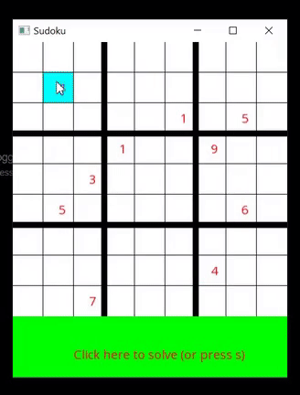

# Colorful Sudoku

This is a small GUI application for a Sudoku Solver, created with the SFML library.

The user can click on squares within the puzzle and enter numbers from 1 to 9. Then, pressing "s" or clicking the bottom bar solves the puzzle, colorfully showing the path that is taken to solve it.

Here's a gif of it solving a random puzzle:  

